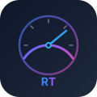

<p align="center">
  
</p>

<h1 align="center">OBDLink MX+ — Technical Documentation</h1>

<p align="center">
  <strong>Ultra-Fast Real-Time OBD-II Telemetry for Android</strong><br/>
  <sub>Powered by OBDLink MX+ &bull; STN2120 &bull; Bluetooth Classic SPP</sub>
</p>

<p align="center">
  
  
  
  
  
</p>

---

<h2 align="center">🌐 Select Language / Wybierz język</h2>

<table align="center">
  <tr>
    <td align="center" width="300">
      <h3>🇬🇧 English</h3>
      <a href="en/technical-reference.md"><strong>📖 Full Documentation →</strong></a>
    </td>
    <td align="center" width="300">
      <h3>🇵🇱 Polski</h3>
      <a href="pl/technical-reference.md"><strong>📖 Pełna Dokumentacja →</strong></a>
    </td>
  </tr>
</table>

---

## 🇬🇧 English Documentation

| Document | Description |
|----------|-------------|
| [**Technical Reference**](en/technical-reference.md) | Complete hardware, protocol & implementation guide |
| [**AT Command Reference**](en/commands/at-commands.md) | ELM327-compatible AT command set |
| [**ST Command Reference**](en/commands/st-commands.md) | STN2120-exclusive extended commands |
| [**PID Reference**](en/pid-reference.md) | Complete Mode 01 PID table with formulas |
| [**Performance Guide**](en/performance-guide.md) | Optimization strategies for real-time polling |
| [**Protocol Stack**](en/protocol-stack.md) | OBD-II protocol deep-dive (CAN, ISO-TP, KWP) |
| [**Android Integration**](en/android-integration.md) | Bluetooth SPP connection & app architecture |

## 🇵🇱 Dokumentacja po Polsku

| Dokument | Opis |
|----------|------|
| [**Dokumentacja Techniczna**](pl/technical-reference.md) | Kompletny przewodnik: sprzęt, protokoły, implementacja |
| [**Komendy AT**](pl/commands/at-commands.md) | Zestaw komend ELM327-compatible |
| [**Komendy ST**](pl/commands/st-commands.md) | Rozszerzone komendy STN2120 |
| [**Tabela PID**](pl/pid-reference.md) | Kompletna tabela PID Mode 01 z formułami |
| [**Optymalizacja**](pl/performance-guide.md) | Strategie optymalizacji real-time polling |
| [**Stos Protokołów**](pl/protocol-stack.md) | Szczegóły protokołów CAN, ISO-TP, KWP |
| [**Integracja Android**](pl/android-integration.md) | Połączenie Bluetooth SPP i architektura aplikacji |

---

## 🧬 Architecture

```
  ┌──────────┐     Bluetooth 3.0     ┌──────────┐     CAN 500K      ┌──────────┐
  │ Android  │ ◄──── SPP/RFCOMM ────► │ OBDLink  │ ◄──── ISO 15765 ──► │ Vehicle  │
  │   App    │     ~5-15ms RTT       │   MX+    │     ~2-5ms RTT    │   ECU    │
  └──────────┘                       └──────────┘                    └──────────┘
```

## ⚡ Performance Targets

| Metric | Target | Notes |
|--------|--------|-------|
| Critical PIDs (RPM, Speed, Throttle) | **30–50 Hz** | Priority Group A |
| High PIDs (Load, MAF) | **15–25 Hz** | Priority Group B |
| Medium PIDs (Temps, Pressure) | **6–10 Hz** | Priority Group C |
| Low PIDs (Fuel, Voltage, Oil) | **3–5 Hz** | Priority Group D |
| Total PID throughput | **80–120 samples/sec** | Combined all groups |
| End-to-end latency | **< 25 ms** | BT + CAN + parse |

## 🗂️ Repository Structure

```
OBDLink_MX-documentation/
├── README.md                         # This file (language selector)
├── LICENSE
├── en/                               # 🇬🇧 English documentation
│   ├── technical-reference.md
│   ├── pid-reference.md
│   ├── performance-guide.md
│   ├── protocol-stack.md
│   ├── android-integration.md
│   └── commands/
│       ├── at-commands.md
│       └── st-commands.md
├── pl/                               # 🇵🇱 Dokumentacja po polsku
│   ├── technical-reference.md
│   ├── pid-reference.md
│   ├── performance-guide.md
│   ├── protocol-stack.md
│   ├── android-integration.md
│   └── commands/
│       ├── at-commands.md
│       └── st-commands.md
└── assets/
    └── logo.svg
```

## 🔑 Key Technical Decisions

- **Bluetooth Classic SPP** over BLE — higher throughput (~300 Kbps vs ~50 Kbps), lower stream latency
- **Physical CAN addressing** (`7E0→7E8`) over broadcast (`7DF`) — eliminates multi-ECU noise
- **ATAT2 aggressive timing** — dynamically minimizes ECU response wait time
- **STPX batch transactions** — 20–30% fewer Bluetooth round-trips vs sequential AT+PID
- **Prioritized PID groups** — critical data at 50 Hz, secondary at lower frequencies
- **Dedicated I/O thread** — never blocks UI, zero `Thread.sleep()` in polling loop

## 🛠️ Tech Stack

| Layer | Technology |
|-------|------------|
| Language | Kotlin |
| UI Framework | Jetpack Compose |
| Async | Kotlin Coroutines + Flows |
| Bluetooth | Android Bluetooth Classic API (SPP/RFCOMM) |
| Architecture | MVVM + Repository pattern |
| State | StateFlow / SharedFlow |
| Background | Foreground Service (START_STICKY) |
| Hardware | OBDLink MX+ (STN2120, BT 3.0 Class 2) |
| Vehicle Protocol | CAN 500K (ISO 15765-4) |

---

<p align="center">
  <sub>Built for speed. Engineered for precision.</sub>
</p>
